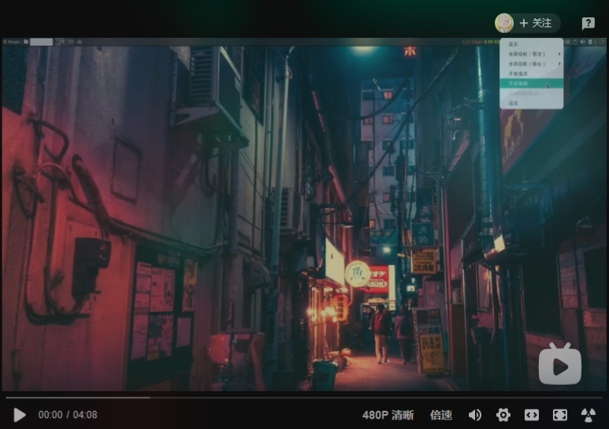

# Hi! world!
  
This is awesome install the shell       
You can 
`git clone https://github.com/denstiny/awesome-config.git`      
配张图片，hhh       


> ## 更新日志  <br>  
* 2021 1-26
	* 删除仓库垃圾文件
	* 取消使用 `compton` 
	* 使用`picom` 窗口渲染
	* 添加 `picom` 配置文件 
	* `src/install.sh` 自动安装脚本
	安装方picom
	```shell
	 > yay -S picom-jonaburg-git
	```
	> 渲染演示
	
* 2021 1-25  
	* 不使用任何依赖添加窗口圆角
	* 改变窗口习惯
	* 改变窗口间隔
	* 使用窗口背景模糊特效 <u><font size=1>克隆[compton](https://github.com/denstiny/compton)</font></u>
	* 添加运行compton脚本，自动切换壁纸, 请在家目录创建一个Imager文件夹存储壁纸
	> 演示
	

## 安装
```shell
# arch 
sudo pacman -S awesome
# ubuntu
sudo apt install awesome
# arch/manjaro 安装
git clone https://github.com/denstiny/awesome-config.git 
bash awesome-config/src/install.sh
# 其他linux 请根据脚本手动安装
git clone https://github.com/denstiny/awesome-config.git 
```
## 演示视频
 <a href="https://www.bilibili.com/video/BV1Xy4y1H7oG?p=1&share_medium=android&share_plat=android&share_source=QQ&share_tag=s_i&timestamp=1611724661&unique_k=pnrOc9">  <span>  
  </a>

### I fucked. I can't keep it up. That's all I have
